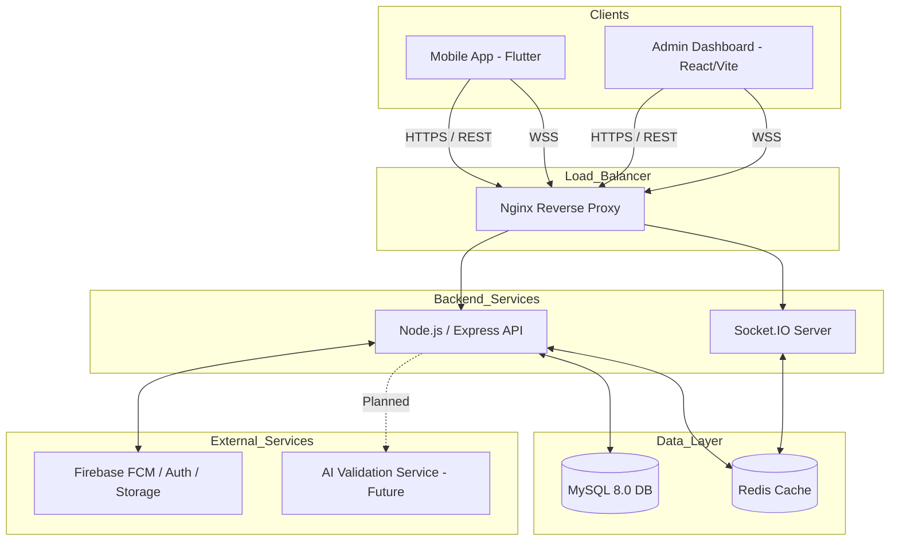
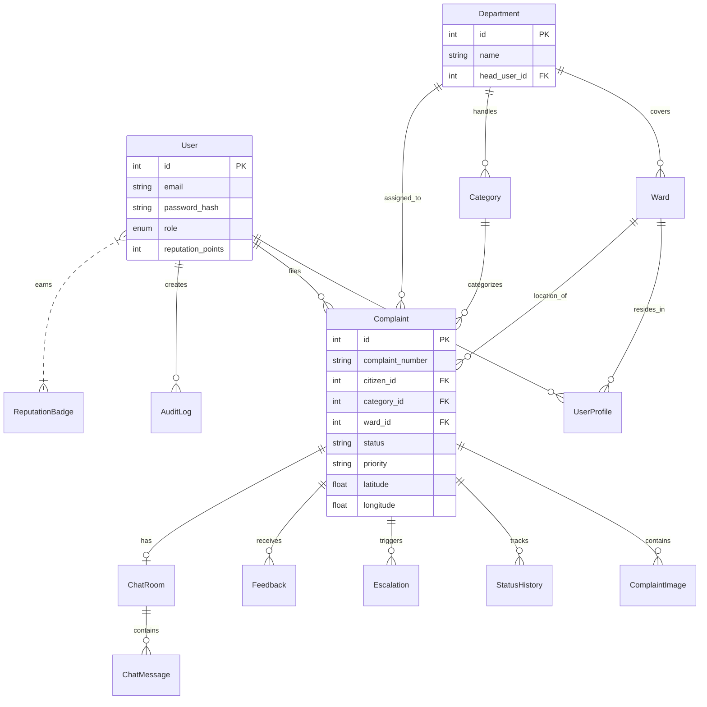
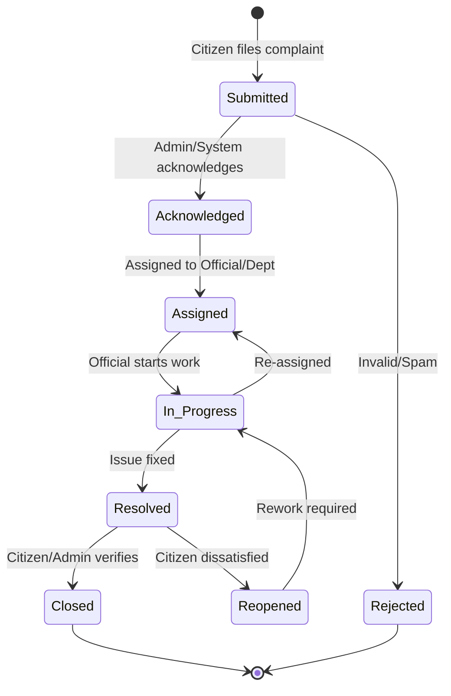
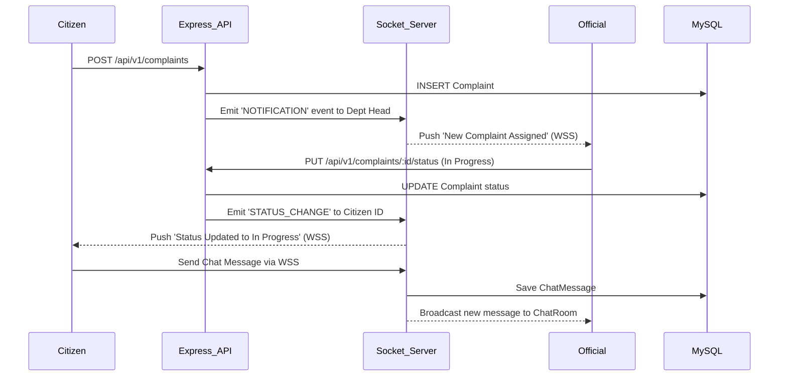

# System Architecture & Diagrams

This document contains Mermaid diagrams illustrating the architecture, data flow, and database schema of the Fix It platform.

## 1. High-Level System Architecture

## 2. Database Entity Relationship Diagram (ERD)

## 3. Complaint Status State Machine

## 4. Socket.IO Real-Time Flow

